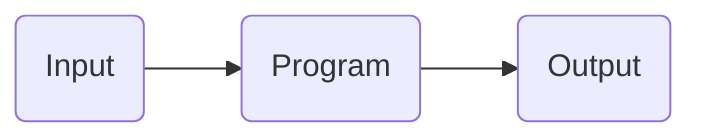

# Programming Mindset

Being a programmer is about more than producing code to operate a robot. You'll need to work with builders, squad leaders, drivers, notebookers, and even other programmers in order to be successful.

## What is programming?

In his first lecture for CS50 2022 (Harvard's introductory computer science course, [which you can check out for free here](https://www.edx.org/course/introduction-computer-science-harvardx-cs50x)), David J. Malan states that computer science is "all about information and...the solving of problems." This problem-solving process essentially boils down to the following diagram:

As a programmer, your main job is to make a **Program** that takes in information (**Input**) and does something with it to produce a desirable outcome (**Output**). Here's how this would work with drive code.
1. **Input:** The inputs are the joystick values sent from the controller to the robot.
2. **Program:** Code that takes the joystick inputs and uses them to send commands to the robot.
3. **Output:** The robot moves as the driver intended.
